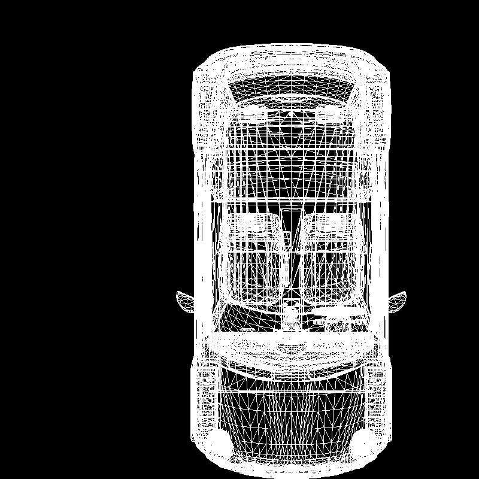
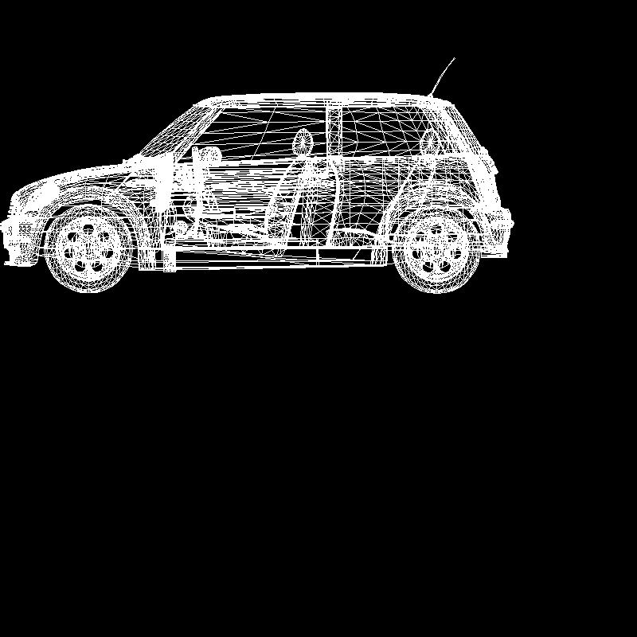
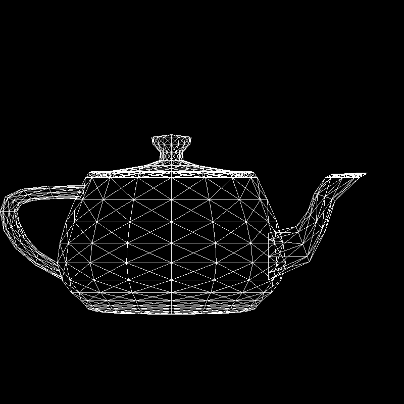
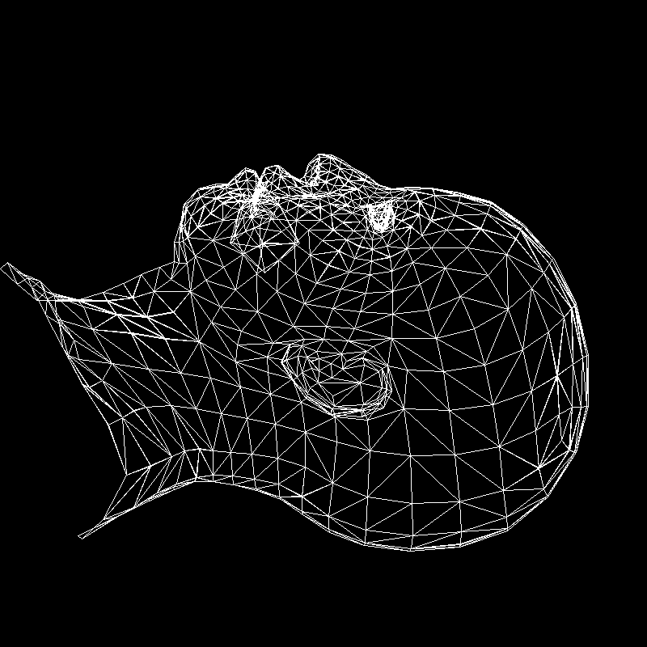

# Tiny Renderer in C (WIP)

Inspired by https://github.com/ssloy/tinyrenderer/wiki

Currently supports wireframe rendering of .OBJ files.

Output files are .TGA images (chosen because of simplicity and 
no need for external image libraries).

<p align="center">
  
  
</p>
<p align="center">
  
  
</p>

## Compilation and usage

To compile run
```
make
```

Then you can run program with the following call
```
./render [path_to_obj_src] [path_to_tga_destin] [xy|xz|yz] [width]
```
where options ```xy, xz, yz``` set the visible axes,
width (optional argument) is the size in pixels of the output image 
(```height = width```). 

If width not given, it defaults to ```width = 800```.

Running program without any arguments
```./render```
is equivalent to
```./render objs/head.obj imgs/head_xy.tga xy 800 800```.

To display correct program call run
```./render -h```
or
```./render --help```.

## Known issues

* If memory can't be allocated, the program exits with error code 1 -
possible memory leak due to abrupt termination.

* Images are not centered.
